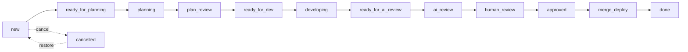
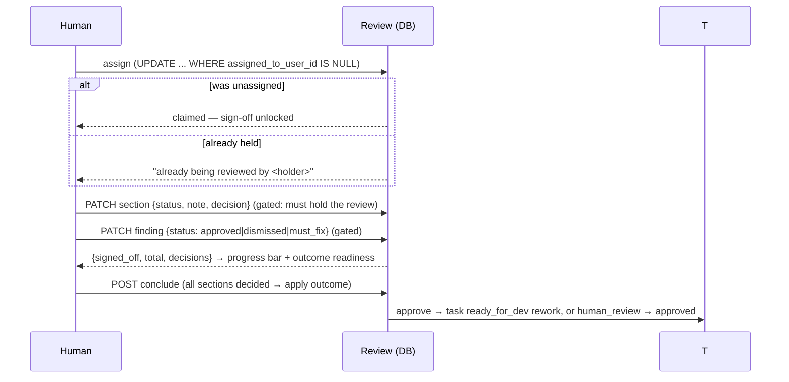
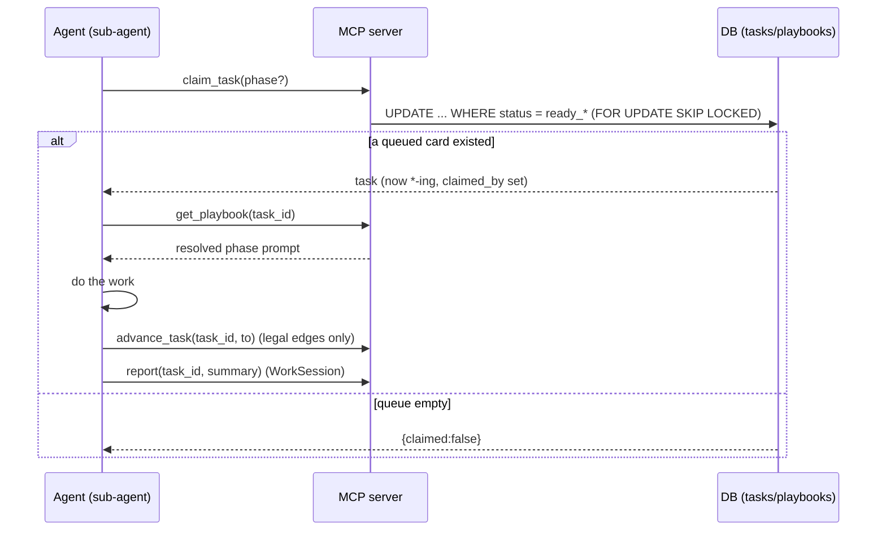

# Architecture — Lodestar

> **How to read:** components (what the pieces are) → flows (how work moves
> through them) → Boundaries (where data crosses into something we don't fully
> control — here, the **MCP / agent-loop surface**, now built). Business language
> + diagrams; technical only where it matters. This file mirrors what's **built**
> today. The thin npx client and the self-update handshake are still backlog and
> noted where they belong, not described as if they exist.

The one sentence to hold onto: **Lodestar is the home base for software work —
humans drive it through a web UI today; AI agents will drive the same data
through MCP later.** A Project holds Tasks (kanban cards on a lifecycle),
WorkSessions (a log), and Reviews (a change walked through section by section).
Everything is owned through the Project, and every screen is scoped to the
signed-in user.

## Components

**The app (`lodestar`, Laravel 13 + Blade + Alpine + Tailwind)**

- **ProjectController** — the project list and the **board**. `show()` loads a
  project's live (non-archived) cards grouped by status, the archived
  (`cancelled`) cards, and the distinct categories for the filter. It hands the
  view `Task::PHASES` so the board can lay the 12 live statuses into 5 phase
  columns.
- **TaskController** — the card write paths:
  - `store()` adds a card to a project (defaults to `new`, lands at the bottom of
    its status).
  - `update()` is the **lifecycle move** — it rejects any status change that
    isn't a legal transition from the card's current status (422 JSON for
    programmatic callers, a validation error for the HTML board), then places the
    card at the bottom of the target status.
  - `move()` is **intra-status reordering** (drag within one column): it rewrites
    `position` for the ids that both belong to the project and already sit in the
    claimed status. It never changes status.
- **ReviewController** — the review surface:
  - `index()` lists a project's reviews; `show()` renders the **walkthrough** —
    the review's ordered sections, the linked tasks, and the assignee chip.
  - `assign()` / `unassign()` are the **atomic self-assignment** endpoints.
  - `updateSection()` persists a section's sign-off / note (called from the
    walkthrough via `fetch`), **gated** on the caller holding the review.
  - `file()` serves the **changed-file viewer** — a per-mode HTML fragment the
    modal injects. `diff` renders the stored unified patch (no GitHub call);
    `full` fetches the head blob and renders the whole file with changed lines
    inline; `preview` renders a markdown file clean; and **`rich`** (the default
    for markdown) renders base→head markdown to HTML with the same engine
    `<x-markdown>` uses and runs **caxy/php-htmldiff** between them so the
    document shows inline `<ins>`/`<del>` highlights. Any mode that can't be
    produced (huge file past the LCS guard, an html-diff throw, an unfetchable /
    binary blob) **degrades to the raw stored patch** rather than a dead end.
    The viewer modal is opened from both the changed-files tree **and** each
    review section's file references via a shared `<x-open-file>` component (the
    one place the `open-file` Alpine event is dispatched).
- **TaskController** also has **`release()`** — the human escape hatch that
  returns a stuck working (`*-ing`) card to its `ready_*` queue and clears the
  claim (we chose this over an automatic lease/reaper).
- **Models** (`app/Models/`) — thin Eloquent models; the lifecycle rules live as
  constants + small helpers on **`Task`** (`STATUSES`, `PHASES`, `ACTORS`,
  `LABELS`, `TRANSITIONS`, `CLAIM_MAP`, `canTransitionTo()`, `phaseFor()`,
  `queueStateFor()`), the claim/release rules live as guarded conditional-UPDATE
  helpers on **`Review`** (`claimFor()`, `releaseFor()`), and playbook composition
  lives on **`Playbook`** (`compose()`, `resolveNamed()`, `slotFor()`).

**The MCP server (`app/Mcp/`, laravel/mcp)** — the agent-facing surface, mirror
of the web UI. `LodestarServer` is registered at `POST /mcp` in `routes/ai.php`
behind `auth:sanctum`, and exposes 16 tools (all extend `LodestarTool`, which
holds the tenancy helpers):

- **Data tools** — `list_projects`, `upsert_project`, `upsert_task`,
  `upsert_session`, `create_review` (returns the URL a human opens),
  `upsert_review_section`, `add_finding`, `get_review`. The agent's read/write
  access to the board, the exact data the controllers serve to the browser.
- **Repository tools** — `link_repository`, `unlink_repository` (attach a repo to
  a project through a GitHub connection).
- **Loop tools** — `claim_task` (atomic claim, by next or by id), `get_playbook`
  (composes the phase prompt — incl. the `main` bootstrap), `propose_playbook_change`
  (proposes a playbook version — always `proposed`, never live), `remember` (captures
  a durable learning as a proposed playbook-layer edit, linked to its work-session),
  `advance_task`
  (legal-transition-only move), `report` (logs a WorkSession).

**Playbooks (`app/Models/Playbook.php`, `PlaybookVersion`, `SystemPlaybookSeeder`)** — playbooks
are **layered**. A `Playbook` is a slot at one scope (`system` / `team` / `project`
/ `personal`); its prompt text lives in versioned `PlaybookVersion` rows, one of them
`active`. A phase prompt is **composed** at run time by `Playbook::compose()` across
scopes in order system → team → project → personal — each layer `append`s, or
`overwrite`s (discarding everything above it). Personal is last so a person always
has the final say (and can test a change locally), unless the project's team sets
`allow_personal_instructions = false`, which drops the personal layer. System playbooks ship
seeded from code. Five phase keys compose: **`main`** — the bootstrap playbook an
agent loads first (`get_playbook(phase:'main')`, no task), carrying the loop +
routing + per-project main instructions; and the four lifecycle phases **`plan` /
`develop` / `ai_review` / `merge`**. Arbitrary **named** keys don't compose —
they resolve to the most-specific scope (`resolveNamed()`), loaded on demand. The
**`ai_review`** playbook encodes the structure-first review method (the 5 modes + the
Laravel structure→mode taxonomy + the surface register, ported from the vps-setup
dev-method). Bodies are delivered at run time via `get_playbook`, not as files on the
developer's machine — so a playbook edit reaches every loop on its next call.
Authoring is **human-gated propose→approve**: anyone in a scope may propose a
`PlaybookVersion` (web or the `propose_playbook_change` MCP tool), only an assigned
approver makes it `active`, and an AI proposal never goes live (the rule is
`Playbook::submitVersion()`). The filterable Playbooks overview (`PlaybookController`,
`settings/playbooks` + `settings/playbook-show`) shows the composed effective prompt,
every layer, version history, a two-version diff (`App\Support\LineDiff`), and the
append/overwrite toggle (approver-only, with a warning).

**Agent modes + the work loop + heartbeat.** `main` is orientation only and defines
two **modes**: *interactive* (a human is driving — work in the human's own checkout,
never `~/ld-agent`) and *background worker* (work ONLY under `~/ld-agent/<slug>/`).
Mode is set by the entry playbook (the `work`/worker prompt declares background and
overrides the interactive default), not by the token — the same MCP token serves
both. A background worker isolates its runtime from the human's via
`COMPOSE_PROJECT_NAME=<slug>-agent` (separate containers/volumes/DB) and bootstraps
its `.env` from the human's checkout or `.env.example` + `key:generate`, halting and
reporting if a real secret is genuinely missing (project-managed secrets are task
#54). The seeded system **`work`** playbook holds the **sequential** loop: claim the
next `ready_*` card (`agent_id:"loop"`), spawn ONE worker subagent for it, finish
before the next — one runtime, no collisions; parallel workers (separate envs) are a
deferred option. A human starts it with the **loop copy-prompt**
(`projects/partials/loop-prompt`) on the project page and each task's lifecycle. The
nav **heartbeat** (`<x-agent-heartbeat>`, `Task::agentSnapshot()`) is derived, not
pinged: it shows "Loop running" / "Agent working" while a reachable card is `*-ing`
(or claimed in the last 10 min), labels the loop by its `claimed_by` of `loop*`, and
hovers to show agent → project. NOTE: in headless/routine runs Claude Code only
exposes *locally* configured MCP servers, so the loop setup must register Lodestar's
MCP locally (`.mcp.json`/`--mcp-config`), not as a claude.ai connector.

Beside it sits the nav **attention tray** (`<x-attention-tray>`, `App\Support\AttentionTray`)
— a derived to-do badge of things genuinely waiting on *this* human, never a feed (it
clears only when the human acts). Three buckets: **playbook proposals** the user may approve
(otherwise invisible until the Playbooks page), **reviews the user is holding** (a claimed
review is a commitment — finish or release), and **overdue / due-soon tasks** (the lone
"urgent"/red bucket; the badge is red if any, else amber). Human-gate cards
(`plan_review`/`human_review`) are deliberately excluded — the board always has some, so a
standing badge for them would be wallpaper.

**Auth & tenancy** — standard Breeze auth for the web; **Sanctum** for MCP.
Agents authenticate with a per-machine personal-access token minted in the web UI
(**AgentTokenController**, "Connect a coding agent" — create / list / revoke,
plaintext shown once). Every project-scoped web controller method asserts
`project->user_id === request->user()->id` (or the review's project owner) and
`abort(403)`; every MCP tool resolves its tenant from the token's user and only
ever queries that user's projects (the `ownedProject/Task/Review/Session`
helpers). There is no row-level `user_id` below Project; ownership is always
reached through the Project.

## Flows

### The lifecycle state machine + board

A Task rides 13 states (12 live + `cancelled`). The board renders the 12 live
states as **5 phase columns**; each card shows the **actor** it waits on (the
colour: needs-human / queued / ai-working / done) and a "Nh in status" timer.

- **`ready_*`** states are queues an agent loop will claim; **`*-ing`** states
  mean an agent is actively on the card (so no double-pickup); **`plan_review`**
  and **`human_review`** are human-only gates.
- Every move is **legal-only**: `Task::TRANSITIONS` is the single source of truth
  (forward · back · cancel per state), enforced in `TaskController::update()` and
  mirrored in the per-card transition buttons. `status_changed_at` is stamped
  automatically by a `saving` hook on the model, so the timer is honest no matter
  which path moved the card.

### The review walkthrough + atomic assignment

A Review is a change to walk through; its **ordered sections** rebuild the
reviewer's context as they descend. Before signing anything off, a human must
**claim** the review:

The claim is a **single conditional UPDATE** — no read-then-write race, no
double-assignment — and release is guarded symmetrically (`WHERE
assigned_to_user_id = :holder`). `updateSection()` re-checks the hold on every
sign-off, so losing the claim (someone releases / reassigns) locks the screen
read-only. A review is linked to the Tasks it covers via the `review_task`
pivot; the walkthrough lists them and each board card links back to its review.

Beyond sign-off, each section also carries a human **decision** (approve /
request changes), and the AI's concerns are first-class **findings** the human
triages (approve / dismiss / must_fix). Once every section is decided the human
**concludes** the review (`reviews.conclude`, gated on the hold): the verdict
drives the linked task(s) — *approve* → `human_review → approved`; *changes* →
`human_review → ready_for_dev` with the compiled rework brief (changes_requested
notes + must_fix findings) written to the task's `rework_notes`. The review's
`outcome` is recorded and it freezes to `done`. This closes the loop: a human
review can send work straight back to the developer without leaving the screen.

### The agent loop (claim → playbook → work → advance → report)

Agents drive the *same* lifecycle the board does, through MCP. The intended
runner (backlog) is a **main agent that polls the queue and spawns one sub-agent
per claimable task** — each sub-agent gets a one-line instruction ("load the
`<phase>` playbook for task N"), does the work, and exits. Because every task is one
claim and each sub-agent is a fresh run, the dev and the AI-review of a task are
naturally different runs — no agent-identity enforcement is needed.

- **`claim_task`** is the only way to start work: it atomically flips the next
  `ready_* → *-ing` (guarded conditional UPDATE; `SKIP LOCKED` on Postgres) and
  stamps `claimed_by`. The human-only gates (`plan_review`, `human_review`) are
  not in `CLAIM_MAP`, so the loop literally cannot claim them.
- **`advance_task`** rejects any move that isn't in `Task::TRANSITIONS` — the same
  guard the board uses — and clears the claim when the card leaves its working
  state. There is no auto-reaper: a stuck `*-ing` card is freed by a human via
  the board's **Release** action (`TaskController::release`).

### Multi-tenancy by ownership

Every project-scoped read and write checks the chain `row → project → user`
against the signed-in user before doing anything. The board only loads the
current project's cards; the reorder endpoint only acts on ids that belong to
the project *and* already sit in the claimed status (it silently drops spoofed
or cross-project ids rather than trusting the request).

## Boundaries

A Boundary is a place where data crosses into a subsystem we don't fully
control. Lodestar's live boundary is **the MCP server** — where an external AI
agent's input crosses into our data writes.

1. **The MCP / agent-loop surface (BUILT).** AI agents drive the *same* Project /
   Task / Review / Session data as the web UI, over `POST /mcp` (laravel/mcp),
   authenticated by a per-machine Sanctum token. What holds the boundary:
   - **Tenancy.** The token resolves to one User; every tool queries only that
     user's projects via the `owned*` helpers. An agent cannot name or reach
     another user's data — the same ownership rule the web enforces, applied at
     the tool layer rather than per controller method.
   - **Lifecycle integrity.** Agent writes go through the *same* invariants as the
     browser: `advance_task` only allows `Task::TRANSITIONS` edges; `claim_task`
     is the guarded conditional UPDATE (`SKIP LOCKED` on Postgres) so concurrent
     agents can't double-claim; `upsert_task` can only *create* cards at a backlog
     state (`new` / `ready_for_planning`) and never moves an existing card's status
     — every lifecycle move goes through `advance_task`. A buggy or hostile client
     cannot put the board in an illegal state.
   - **Input validation.** Every tool validates its arguments with Laravel
     validation (modes constrained to `ReviewSection::MODES`, statuses to
     `Task::STATUSES`, phases to `Playbook::PHASES`) before any write. Long-form
     fields are paired with a scannable summary that the UI shows by default
     (`body`/`body_summary`, `plan`/`plan_summary`): a summary is mandatory
     whenever its detail is set (`required_with`), enforced identically at the
     MCP tools (`upsert_task`, `upsert_session`, `report`) and the web form —
     so detail never lands without a TL;DR. Not applied retroactively to rows
     written before the rule.
   - **Playbook delivery.** `get_playbook` returns prompt *text* the agent then runs;
     the composition (which scope layers, append vs overwrite) is decided
     server-side. A malformed system playbook is the one thing that could mislead
     every loop at once, so playbook bodies are versioned and treated as reviewable
     logic — every change is a `PlaybookVersion`, and any prior `active` version
     stays pinnable for rollback. AI clients may *propose* a version over MCP but
     can never make one `active` (human-gated approval — task #53 P3).

2. **The GitHub compare API (BUILT).** When a review is created from a comparison
   (`repo` + `base_ref`…`head_ref`), Lodestar fetches the changed-file list
   server-side from GitHub's compare endpoint (`App\Services\GitHubComparison`,
   the `Http` client + a `GITHUB_TOKEN`). This is deliberately the boundary's
   *authority*: the file set is ground truth from GitHub, **not** the AI's claim,
   so the agent can only group files it cannot omit. What holds it:
   - **Coverage guard.** Each `review_files` row must be allocated to ≥1
     `ReviewSection` (`review_file_section`); `upsert_review_section` rejects any
     path not in the comparison, and `advance_task → human_review` is refused
     while any linked review has uncovered files. The human sees a GitHub-ordered
     **file-tree** at the top of the walkthrough, each file tagged with its
     covering section(s) and uncovered files flagged — so "I stepped through every
     section" provably means "every changed file was reviewed".
   - **Token scope.** Repos are first-class: a user links **GitHub connections**
     (one per account/token, stored encrypted) and attaches **repositories** to a
     project (many-to-many — a project = a "stack" of repos). Each repo is read
     through its connection's token, so a review fetches its comparison with the
     right account's credentials. (The old server `GITHUB_TOKEN` env was removed;
     `config('services.github.token')` now resolves to null and the per-connection
     token is the source.) `GitHubComparison` pages the compare endpoint
     (100/page) and accumulates up to `MAX_FILES` (3000); a diff beyond that
     throws rather than silently under-covering the coverage guard.
   - **Backfilling old reviews.** Reviews created before patches/SHAs were
     stored have null `patch` rows and null `base_sha`/`head_sha`, so the viewer
     can't render their diffs. `php artisan reviews:backfill-patches {review}`
     resolves+persists the SHAs (if null), re-fetches the comparison, and
     enriches each **existing** `review_files` row (matched by path) with its
     patch/additions/deletions. It never adds or removes rows — the file set
     (and its coverage allocation) is left exactly as it was — and is idempotent.

**Rendering the diff (`App\Support\DiffRenderer`).** Turns diffs into render-ready
rows for the viewer's Blade partials. `renderPatch()` parses a stored unified
patch; `renderFullFile()` diffs base→head over the dependency-free
`App\Support\LineDiff` (an LCS — the same differ the playbook compare uses), with
a `FULL_FILE_LINE_LIMIT` (~2000) guard that returns null so the controller shows
the raw patch instead of building an O(m·n) table for a giant file.
`renderRichMarkdown()` is the one HTML-emitting path: it is **the only place
caxy/php-htmldiff is used** — the dependency boundary is contained to this method
(and the `<x-markdown>` `ins`/`del` prose styling), so the rest of the app never
touches the html-diff library. (The runtime `sebastian/diff` dependency was
dropped when `renderFullFile` moved to `LineDiff`; it stays available
transitively via phpunit for tests.)

3. **The secrets endpoint (BUILT — out-of-MCP by design).** A project declares a
   manifest of required env **keys** (`ProjectSecretRequirement`, approver-managed);
   each user provides their own encrypted **values** (`PersonalSecret`). An agent
   imports its user's values via `GET /api/projects/{project}/secrets` (Sanctum
   token + `agent` ability, `routes/api.php`), which returns `.env` lines (or `409`
   + `# missing:` keys). This is deliberately NOT an MCP tool: the agent `curl`s it
   to a file so values never enter the MCP/LLM context. What holds it: values are
   encrypted at rest, the endpoint is tenant-scoped (the project's access rule) and
   only ever returns the **calling** user's own values; the boundary is
   keep-out-of-context, not process-sandboxing (the playbook instructs "don't print
   the file").

**Still backlog (not built):** the thin npx client (`connect` + `run`) and the
`check_version` self-update handshake — the only pieces that would live on the
developer's machine. Until they exist, agents are wired to `/mcp` by hand. When
the loop surface grows past a screen it likely graduates to its own doc.
