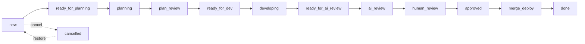
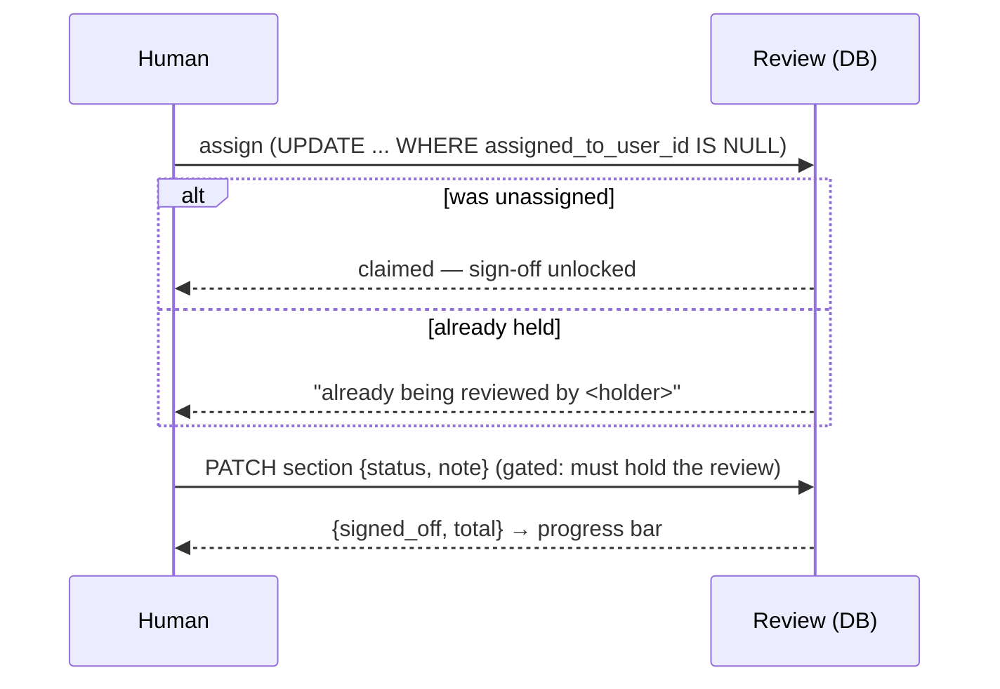
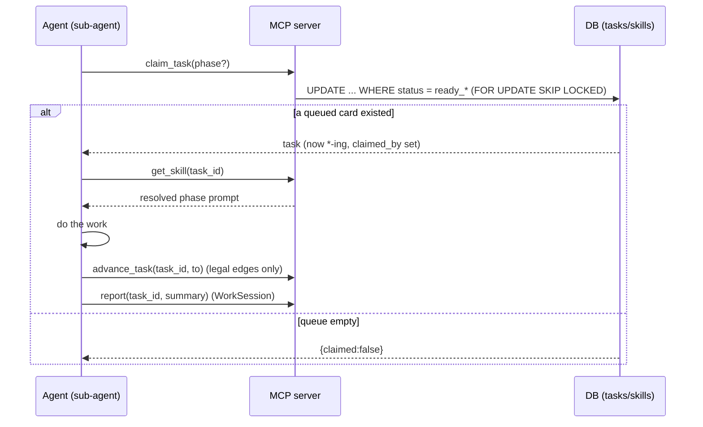

# Architecture — Lodestar

> **How to read:** components (what the pieces are) → flows (how work moves
> through them) → Boundaries (where data crosses into something we don't fully
> control — here, the **MCP / agent-loop surface**, now built). Business language
> + diagrams; technical only where it matters. This file mirrors what's **built**
> today. The thin npx client and the self-update handshake are still backlog and
> noted where they belong, not described as if they exist.

The one sentence to hold onto: **Lodestar is the home base for software work —
humans drive it through a web UI today; AI agents will drive the same data
through MCP later.** A Project holds Tasks (kanban cards on a lifecycle),
WorkSessions (a log), and Reviews (a change walked through section by section).
Everything is owned through the Project, and every screen is scoped to the
signed-in user.

## Components

**The app (`lodestar`, Laravel 13 + Blade + Alpine + Tailwind)**

- **ProjectController** — the project list and the **board**. `show()` loads a
  project's live (non-archived) cards grouped by status, the archived
  (`cancelled`) cards, and the distinct categories for the filter. It hands the
  view `Task::PHASES` so the board can lay the 12 live statuses into 5 phase
  columns.
- **TaskController** — the card write paths:
  - `store()` adds a card to a project (defaults to `new`, lands at the bottom of
    its status).
  - `update()` is the **lifecycle move** — it rejects any status change that
    isn't a legal transition from the card's current status (422 JSON for
    programmatic callers, a validation error for the HTML board), then places the
    card at the bottom of the target status.
  - `move()` is **intra-status reordering** (drag within one column): it rewrites
    `position` for the ids that both belong to the project and already sit in the
    claimed status. It never changes status.
- **ReviewController** — the review surface:
  - `index()` lists a project's reviews; `show()` renders the **walkthrough** —
    the review's ordered sections, the linked tasks, and the assignee chip.
  - `assign()` / `unassign()` are the **atomic self-assignment** endpoints.
  - `updateSection()` persists a section's sign-off / note (called from the
    walkthrough via `fetch`), **gated** on the caller holding the review.
- **TaskController** also has **`release()`** — the human escape hatch that
  returns a stuck working (`*-ing`) card to its `ready_*` queue and clears the
  claim (we chose this over an automatic lease/reaper).
- **Models** (`app/Models/`) — thin Eloquent models; the lifecycle rules live as
  constants + small helpers on **`Task`** (`STATUSES`, `PHASES`, `ACTORS`,
  `LABELS`, `TRANSITIONS`, `CLAIM_MAP`, `canTransitionTo()`, `phaseFor()`,
  `queueStateFor()`), the claim/release rules live as guarded conditional-UPDATE
  helpers on **`Review`** (`claimFor()`, `releaseFor()`), and skill resolution
  lives on **`Skill`** (`resolve()`, `currentSystem()`).

**The MCP server (`app/Mcp/`, laravel/mcp)** — the agent-facing surface, mirror
of the web UI. `LodestarServer` is registered at `POST /mcp` in `routes/ai.php`
behind `auth:sanctum`, and exposes ten tools (all extend `LodestarTool`, which
holds the tenancy helpers):

- **Data tools** — `upsert_project`, `upsert_task`, `upsert_session`,
  `create_review` (returns the URL a human opens), `upsert_review_section`,
  `get_review`. These are the agent's read/write access to the board, the exact
  data the controllers serve to the browser.
- **Loop tools** — `claim_task` (atomic claim, below), `get_skill` (resolves the
  phase prompt for a claimed task), `advance_task` (legal-transition-only move),
  `report` (logs a WorkSession).

**Skills (`app/Models/Skill.php`, `SkillBinding`, `SystemSkillSeeder`)** — the
four phase prompts ship as `system` skills (seeded/upserted from code) and are
resolved per user/project through `skill_bindings`; a user may fork one into an
editable `user` skill. The skill body is delivered at run time via `get_skill`,
not as a file on the developer's machine — so a skill edit reaches every loop on
its next call.

**Auth & tenancy** — standard Breeze auth for the web; **Sanctum** for MCP.
Agents authenticate with a per-machine personal-access token minted in the web UI
(**AgentTokenController**, "Connect a coding agent" — create / list / revoke,
plaintext shown once). Every project-scoped web controller method asserts
`project->user_id === request->user()->id` (or the review's project owner) and
`abort(403)`; every MCP tool resolves its tenant from the token's user and only
ever queries that user's projects (the `ownedProject/Task/Review/Session`
helpers). There is no row-level `user_id` below Project; ownership is always
reached through the Project.

## Flows

### The lifecycle state machine + board

A Task rides 13 states (12 live + `cancelled`). The board renders the 12 live
states as **5 phase columns**; each card shows the **actor** it waits on (the
colour: needs-human / queued / ai-working / done) and a "Nh in status" timer.

- **`ready_*`** states are queues an agent loop will claim; **`*-ing`** states
  mean an agent is actively on the card (so no double-pickup); **`plan_review`**
  and **`human_review`** are human-only gates.
- Every move is **legal-only**: `Task::TRANSITIONS` is the single source of truth
  (forward · back · cancel per state), enforced in `TaskController::update()` and
  mirrored in the per-card transition buttons. `status_changed_at` is stamped
  automatically by a `saving` hook on the model, so the timer is honest no matter
  which path moved the card.

### The review walkthrough + atomic assignment

A Review is a change to walk through; its **ordered sections** rebuild the
reviewer's context as they descend. Before signing anything off, a human must
**claim** the review:

The claim is a **single conditional UPDATE** — no read-then-write race, no
double-assignment — and release is guarded symmetrically (`WHERE
assigned_to_user_id = :holder`). `updateSection()` re-checks the hold on every
sign-off, so losing the claim (someone releases / reassigns) locks the screen
read-only. A review is linked to the Tasks it covers via the `review_task`
pivot; the walkthrough lists them and each board card links back to its review.

### The agent loop (claim → skill → work → advance → report)

Agents drive the *same* lifecycle the board does, through MCP. The intended
runner (backlog) is a **main agent that polls the queue and spawns one sub-agent
per claimable task** — each sub-agent gets a one-line instruction ("load the
`<phase>` skill for task N"), does the work, and exits. Because every task is one
claim and each sub-agent is a fresh run, the dev and the AI-review of a task are
naturally different runs — no agent-identity enforcement is needed.

- **`claim_task`** is the only way to start work: it atomically flips the next
  `ready_* → *-ing` (guarded conditional UPDATE; `SKIP LOCKED` on Postgres) and
  stamps `claimed_by`. The human-only gates (`plan_review`, `human_review`) are
  not in `CLAIM_MAP`, so the loop literally cannot claim them.
- **`advance_task`** rejects any move that isn't in `Task::TRANSITIONS` — the same
  guard the board uses — and clears the claim when the card leaves its working
  state. There is no auto-reaper: a stuck `*-ing` card is freed by a human via
  the board's **Release** action (`TaskController::release`).

### Multi-tenancy by ownership

Every project-scoped read and write checks the chain `row → project → user`
against the signed-in user before doing anything. The board only loads the
current project's cards; the reorder endpoint only acts on ids that belong to
the project *and* already sit in the claimed status (it silently drops spoofed
or cross-project ids rather than trusting the request).

## Boundaries

A Boundary is a place where data crosses into a subsystem we don't fully
control. Lodestar's live boundary is **the MCP server** — where an external AI
agent's input crosses into our data writes.

1. **The MCP / agent-loop surface (BUILT).** AI agents drive the *same* Project /
   Task / Review / Session data as the web UI, over `POST /mcp` (laravel/mcp),
   authenticated by a per-machine Sanctum token. What holds the boundary:
   - **Tenancy.** The token resolves to one User; every tool queries only that
     user's projects via the `owned*` helpers. An agent cannot name or reach
     another user's data — the same ownership rule the web enforces, applied at
     the tool layer rather than per controller method.
   - **Lifecycle integrity.** Agent writes go through the *same* invariants as the
     browser: `advance_task` only allows `Task::TRANSITIONS` edges; `claim_task`
     is the guarded conditional UPDATE (`SKIP LOCKED` on Postgres) so concurrent
     agents can't double-claim; `upsert_task` can only *create* cards at a backlog
     state (`new` / `ready_for_planning`) and never moves an existing card's status
     — every lifecycle move goes through `advance_task`. A buggy or hostile client
     cannot put the board in an illegal state.
   - **Input validation.** Every tool validates its arguments with Laravel
     validation (modes constrained to `ReviewSection::MODES`, statuses to
     `Task::STATUSES`, phases to `Skill::PHASES`) before any write.
   - **Skill delivery.** `get_skill` returns prompt *text* the agent then runs;
     the resolution (fork vs system) is decided server-side. A malformed system
     skill is the one thing that could mislead every loop at once, so skills are
     versioned and treated as reviewable logic (the previous system version stays
     pinnable for rollback).

2. **The GitHub compare API (BUILT).** When a review is created from a comparison
   (`repo` + `base_ref`…`head_ref`), Lodestar fetches the changed-file list
   server-side from GitHub's compare endpoint (`App\Services\GitHubComparison`,
   the `Http` client + a `GITHUB_TOKEN`). This is deliberately the boundary's
   *authority*: the file set is ground truth from GitHub, **not** the AI's claim,
   so the agent can only group files it cannot omit. What holds it:
   - **Coverage guard.** Each `review_files` row must be allocated to ≥1
     `ReviewSection` (`review_file_section`); `upsert_review_section` rejects any
     path not in the comparison, and `advance_task → human_review` is refused
     while any linked review has uncovered files. The human sees a GitHub-ordered
     **file-tree** at the top of the walkthrough, each file tagged with its
     covering section(s) and uncovered files flagged — so "I stepped through every
     section" provably means "every changed file was reviewed".
   - **Token scope.** Repos are first-class: a user links **GitHub connections**
     (one per account/token, stored encrypted) and attaches **repositories** to a
     project (many-to-many — a project = a "stack" of repos). Each repo is read
     through its connection's token, so a review fetches its comparison with the
     right account's credentials. (A server `GITHUB_TOKEN` remains as a fallback.)
     Compare returns ≤300 files per response — a diff at that cap throws, not
     silently truncated.

**Still backlog (not built):** the thin npx client (`connect` + `run`) and the
`check_version` self-update handshake — the only pieces that would live on the
developer's machine. Until they exist, agents are wired to `/mcp` by hand. When
the loop surface grows past a screen it likely graduates to its own doc.
