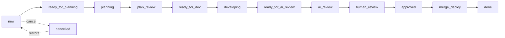
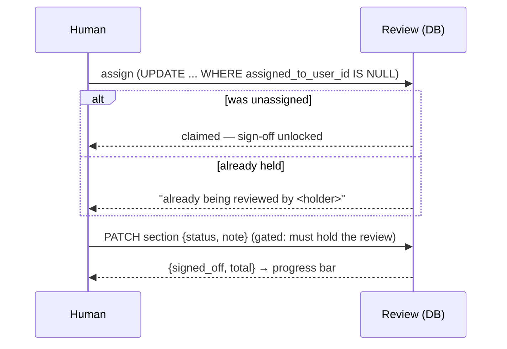

# Architecture — Lodestar

> **How to read:** components (what the pieces are) → flows (how work moves
> through them) → Boundaries (where data crosses into something we don't fully
> control — here, the *planned* MCP / agent-loop surface). Business language +
> diagrams; technical only where it matters. This file mirrors what's **built**
> today; the not-yet-built design (MCP, the agent loop, skills) is noted as a
> Boundary and lives in the backlog, not here.

The one sentence to hold onto: **Lodestar is the home base for software work —
humans drive it through a web UI today; AI agents will drive the same data
through MCP later.** A Project holds Tasks (kanban cards on a lifecycle),
WorkSessions (a log), and Reviews (a change walked through section by section).
Everything is owned through the Project, and every screen is scoped to the
signed-in user.

## Components

**The app (`lodestar`, Laravel 13 + Blade + Alpine + Tailwind)**

- **ProjectController** — the project list and the **board**. `show()` loads a
  project's live (non-archived) cards grouped by status, the archived
  (`cancelled`) cards, and the distinct categories for the filter. It hands the
  view `Task::PHASES` so the board can lay the 12 live statuses into 5 phase
  columns.
- **TaskController** — the card write paths:
  - `store()` adds a card to a project (defaults to `new`, lands at the bottom of
    its status).
  - `update()` is the **lifecycle move** — it rejects any status change that
    isn't a legal transition from the card's current status (422 JSON for
    programmatic callers, a validation error for the HTML board), then places the
    card at the bottom of the target status.
  - `move()` is **intra-status reordering** (drag within one column): it rewrites
    `position` for the ids that both belong to the project and already sit in the
    claimed status. It never changes status.
- **ReviewController** — the review surface:
  - `index()` lists a project's reviews; `show()` renders the **walkthrough** —
    the review's ordered sections, the linked tasks, and the assignee chip.
  - `assign()` / `unassign()` are the **atomic self-assignment** endpoints.
  - `updateSection()` persists a section's sign-off / note (called from the
    walkthrough via `fetch`), **gated** on the caller holding the review.
- **Models** (`app/Models/`) — thin Eloquent models; the lifecycle rules live as
  constants + small helpers on **`Task`** (`STATUSES`, `PHASES`, `ACTORS`,
  `LABELS`, `TRANSITIONS`, `canTransitionTo()`, `transitionKind()`), and the
  claim/release rules live as guarded conditional-UPDATE helpers on **`Review`**
  (`claimFor()`, `releaseFor()`).

**Auth & tenancy** — standard Breeze auth. Every project-scoped controller
method asserts `project->user_id === request->user()->id` (or the review's
project owner) and `abort(403)` otherwise. There is no row-level `user_id` below
Project; ownership is always reached through the Project.

## Flows

### The lifecycle state machine + board

A Task rides 13 states (12 live + `cancelled`). The board renders the 12 live
states as **5 phase columns**; each card shows the **actor** it waits on (the
colour: needs-human / queued / ai-working / done) and a "Nh in status" timer.

- **`ready_*`** states are queues an agent loop will claim; **`*-ing`** states
  mean an agent is actively on the card (so no double-pickup); **`plan_review`**
  and **`human_review`** are human-only gates.
- Every move is **legal-only**: `Task::TRANSITIONS` is the single source of truth
  (forward · back · cancel per state), enforced in `TaskController::update()` and
  mirrored in the per-card transition buttons. `status_changed_at` is stamped
  automatically by a `saving` hook on the model, so the timer is honest no matter
  which path moved the card.

### The review walkthrough + atomic assignment

A Review is a change to walk through; its **ordered sections** rebuild the
reviewer's context as they descend. Before signing anything off, a human must
**claim** the review:

The claim is a **single conditional UPDATE** — no read-then-write race, no
double-assignment — and release is guarded symmetrically (`WHERE
assigned_to_user_id = :holder`). `updateSection()` re-checks the hold on every
sign-off, so losing the claim (someone releases / reassigns) locks the screen
read-only. A review is linked to the Tasks it covers via the `review_task`
pivot; the walkthrough lists them and each board card links back to its review.

### Multi-tenancy by ownership

Every project-scoped read and write checks the chain `row → project → user`
against the signed-in user before doing anything. The board only loads the
current project's cards; the reorder endpoint only acts on ids that belong to
the project *and* already sit in the claimed status (it silently drops spoofed
or cross-project ids rather than trusting the request).

## Boundaries

A Boundary is a place where data crosses into a subsystem we don't fully
control. Lodestar has **no live external boundary today** — there is no LLM
call, no third-party API, no generated query in the built app. The one Boundary
that matters is **planned, not built**, and is called out here so it isn't
forgotten when it lands:

1. **The MCP / agent-loop surface (PLANNED — not built).** The intended design is
   that AI agents drive the *same* Project / Task / Review data through an MCP
   server (HTTP/SSE, token-authed, scoped to the token's user), and an agent loop
   claims `ready_*` cards, advances them, and prepares Reviews. When that lands it
   becomes the real boundary: agent input crosses into our data writes, and the
   atomic primitives already built here (the legal-transition guard, the
   `WHERE NULL` claim) are exactly the server-side checks that must hold against
   an agent the same way they hold against a browser. Until then this is a
   **gap**, tracked as backlog cards (`mcp`, `loop`, `skills`), not a mirror
   entry — this section is the placeholder, not a description of running code.

When the MCP surface is built, this section graduates to a full Boundaries
treatment (what the agent can write, how the token scopes tenancy, how claim /
advance map to the lifecycle) — and likely to its own doc once it outgrows a
screen.
