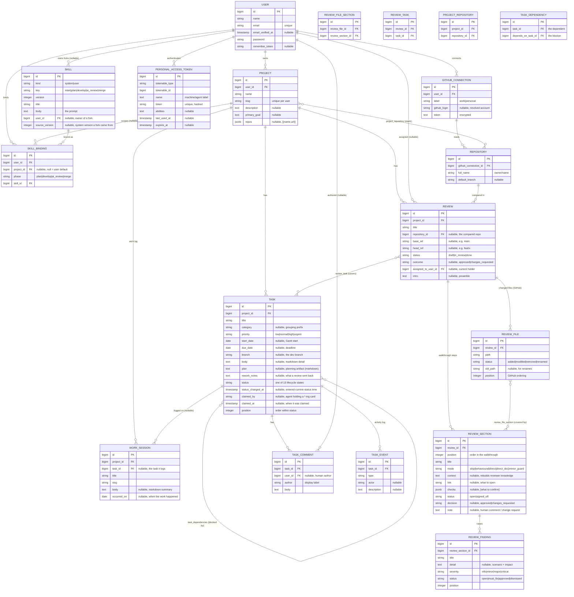

# Data model — Lodestar

> **How to read:** the **Tables** and **Invariants** below are the summary you
> read first; the **Diagram** at the end is the exact picture — every migrated
> app table with its fields and types. This file **mirrors the built schema**:
> every table that exists in `www/database/migrations/`. A test
> (`tests/Feature/SchemaMirrorTest.php`) parses the diagram and asserts it
> matches the live schema, so this doc cannot silently drift.

Lodestar is the home base for software work: **Projects** hold **Tasks** (kanban
cards that ride a 13-state lifecycle), **WorkSessions** (a work-log), and
**Reviews** (a change reviewed against a base, walked through as ordered
**ReviewSections**). **Skills** are the versioned prompts that drive each loop
phase, and **SkillBindings** pick which skill a user's loop runs. Everything is
**multi-tenant by ownership** — a Project belongs to a User, and everything else
reaches its owner through that Project; AI agents reach the same data through MCP,
authenticated by a per-machine **PersonalAccessToken** (Sanctum).

## Tables (the nouns)

- **Project** — a group of repos with a shared goal, owned by a `user`. The home
  base its tasks, work-sessions and reviews all hang off. `name` + a per-user
  unique `slug`; an optional `description` and `primary_goal`; `repos` is a JSON
  list of `{ name, url }` (kept as JSON until a Repo model earns its own table).
- **Task** — a kanban card. `status` is one of the **13 lifecycle states** (see
  Invariants); `position` orders cards within a single status; `category` is a
  free-text grouping prefix (e.g. `mcp`, `infra`); `body` is the card detail.
  `status_changed_at` records when the card last entered its current status (the
  "Nh in status" timer) and is stamped automatically on every status change.
  `claimed_by` / `claimed_at` record which agent currently holds a working
  (`*-ing`) card and since when — set by the atomic MCP claim, cleared when the
  card moves on. There is no lease column: a stuck card is freed by a human, not
  a reaper (see Invariants).
- **WorkSession** — a work-log entry (the running history a project kept).
  `title` + `slug`, a markdown `body`, and `occurred_on` (the date the work
  happened). Named `work_sessions` so it never collides with Laravel's framework
  `sessions` table. *(Model + table exist; no UI yet.)*
- **Review** — a change reviewed against a base (e.g. a branch vs main). Carries
  `base_ref`/`head_ref` (the intended comparison), a `status` (draft / in_review
  / done), an `intro` preamble, and `assigned_to_user_id` — the human currently
  holding the review. A human must **atomically self-assign** a review before
  they may sign off its sections (the human mirror of an agent claiming a task).
  A review covers many tasks and a task can appear in many reviews (the
  `review_task` pivot).
- **GithubConnection** — one GitHub account/token a user has linked. `label`
  ("work"/"personal"), the resolved `github_login`, and the `token` (stored
  **encrypted**). A user may have several; each Repository is read through one.
- **Repository** — a GitHub repo (`full_name` = "owner/name", `default_branch`),
  read through a `github_connection`. Linked to projects many-to-many via
  `project_repository`. A Review's comparison is within one Repository.
- **ReviewFile** — one file the review's comparison changed, as reported by the
  **GitHub compare API** (`repo` + `base_ref`…`head_ref` on the Review). `path`,
  `status` (added/modified/removed/renamed), `old_path` for renames, and
  `position` (GitHub's own ordering, so the UI file-tree matches GitHub). This set
  is the **ground truth** the coverage guard checks against — the AI never
  supplies it.
- **ReviewSection** — one ordered step of a review walkthrough — the data behind
  the HTML walkthrough screen. `position` orders the sections; `mode` is the
  review mode (`skip` / `behavioural` / `direct` / `direct_doc` / `mirror_guard`);
  `context` rebuilds the reviewer's knowledge; `link` is what to open (a doc /
  file / route); `checks` is a JSON list of "what to confirm"; `status`
  (`open` / `signed_off`) + `note` carry the human's per-section sign-off.

- **Skill** — a versioned prompt that drives one loop phase. `kind` is `system`
  (ours, read-only, `user_id` null — shipped from code and upserted on deploy,
  unique per `key`+`version`) or `user` (a user's editable fork, with
  `source_version` recording the system version it was cloned from). `key` is the
  phase (`plan` / `develop` / `ai_review` / `merge`); `title` + `body` (the
  prompt) are what `get_skill` returns.
- **SkillBinding** — which Skill a user's loop runs for a phase. `user_id` +
  `phase` + an optional `project_id` (null = the user's default across projects;
  a row with a project overrides it there) point at a `skill_id`. No binding row
  → the loop falls back to the current system skill, so system-skill updates
  reach unbound users automatically.
- **PersonalAccessToken** — Sanctum's API token (one per machine/agent). The MCP
  server authenticates each request from the `Authorization: Bearer` token and
  resolves the tenant (`tokenable` = the User); `name` is the machine label
  (also the default `claimed_by`), `abilities` carries the `agent` scope.

**Pivots**

- **review_task** — the many-to-many link between a Review and the Tasks it
  covers. Unique `(review_id, task_id)`; both sides cascade-delete, so the link
  disappears with either end.
- **project_repository** — the many-to-many link between a Project and the
  Repositories it spans (its "stack"). Unique `(project_id, repository_id)`; both
  sides cascade-delete.
- **review_file_section** — the many-to-many link between a ReviewFile and the
  ReviewSections that cover it. A file may be covered by several sections and must
  be covered by at least one (the coverage guard). Unique
  `(review_file_id, review_section_id)`; both sides cascade-delete.

(Laravel scaffolding — `sessions`, `cache`, `jobs`, etc. — is standard and
omitted here, except `users` (the ownership root) and `personal_access_tokens`
(the MCP auth boundary), which the diagram draws.)

## Invariants

These are the rules the column list alone won't tell you:

- **Multi-tenant by ownership.** A Project `belongsTo` a User; Tasks,
  WorkSessions and Reviews `belongsTo` a Project. There is no per-row `user_id`
  below Project — ownership is reached through `project.user_id`, and every
  controller method checks `project->user_id === request->user()->id` (403
  otherwise). `(user_id, slug)` is unique, so a slug is unique *per user*, not
  globally.
- **A Task's status is one of 13 — 12 live + `cancelled`.** The live pipeline,
  in order: `new → ready_for_planning → planning → plan_review → ready_for_dev →
  developing → ready_for_ai_review → ai_review → human_review → approved →
  merge_deploy → done`. `cancelled` is the archive (a soft-delete; there is no
  hard delete). The board groups the 12 live states into **5 phase columns**
  (Backlog · Plan · Build · Review · Ship) and colours each card by the **actor**
  it waits on (needs-human / queued / ai-working / done / archived).
- **Status moves are legal-only.** A Task may only move to a status in its
  allowed-transition set (`Task::TRANSITIONS`); an illegal jump is rejected (422
  / validation error). The transition map is forward · back · cancel per state,
  with `cancelled` restoring to `new`. The lists, phases, actors, labels and
  transition map all live as constants on `App\Models\Task`.
- **`status_changed_at` is stamped automatically.** A `saving` model hook stamps
  it whenever `status` is dirty (or on first save), so every code path — the
  board, tinker, a future agent loop — keeps the timer honest. A non-status edit
  never re-stamps it.
- **`position` orders within a single status, not across the board.** A new card
  lands at `max(position) + 1` within its status; intra-status drag rewrites
  `position` for exactly the cards in that status. Reordering never changes
  status — lifecycle moves go through the transition path so only legal moves
  are allowed.
- **A task is claimed by a single agent at a time, atomically.** An agent claims
  the next `ready_*` card over MCP via a **conditional UPDATE guarded on the old
  status** (`WHERE status = :queue_state`) — the same check-and-set shape as the
  review claim — so two concurrent agents can never both win a card. On Postgres
  the claim query also uses `FOR UPDATE SKIP LOCKED` so concurrent claimers skip
  past each other's rows instead of contending. The claim flips `ready_* → *-ing`
  and stamps `claimed_by` + `claimed_at`.
- **No lease, no reaper — a human frees a stuck card.** We deliberately did *not*
  add a lease / heartbeat / auto-reclaim. The happy flow is expected; if an agent
  crashes mid-task, a human presses **Release** on the board, which returns the
  `*-ing` card to its `ready_*` queue and clears the claim so the loop re-picks it.
- **Skill resolution is server-side.** `get_skill` resolves the skill for a phase
  as: a project-specific `SkillBinding` → the user's default binding → the current
  (highest-version) system skill. So editing a system skill updates every unbound
  user's loop on their next call, with no client change.
- **Every changed file must be covered by a section (the coverage guard).** A
  review built from a GitHub comparison stores its changed files as `review_files`
  (fetched server-side from GitHub — never the AI's claim). Each ReviewSection
  declares which files it covers (`review_file_section`); a file may sit in several
  sections but must sit in **at least one**. `Review::coverage()` computes the
  uncovered set, and `advance_task → human_review` is **rejected** while any linked
  review has uncovered files — so a review can only reach a human once it provably
  accounts for every changed file. A review with no files (doc-only) is trivially
  complete.
- **A review is claimed by a single human at a time.** `assigned_to_user_id` is
  set by a **conditional UPDATE guarded on `WHERE assigned_to_user_id IS NULL`**
  (`Review::claimFor`), making claim a single atomic check-and-set — no
  read-then-write race, no double-assignment. Release is guarded the same way
  (`WHERE assigned_to_user_id = :holder`), so a non-holder can never clear
  another reviewer's claim. Section sign-off is gated on holding the review.
- **The walkthrough is the section list, top-to-bottom.** A Review's sections
  are ordered by `position`; the screen rebuilds context as the reviewer
  descends, and the progress bar / "ready" banner are driven by how many
  sections are `signed_off`.
- **The review outcome drives the task.** Each ReviewSection carries a human
  `decision` (`approved` / `changes_requested`), distinct from its sign-off. Once
  **every** section is decided the human applies the outcome (`reviews.conclude`):
  the verdict is `changes_requested` if any section requests changes, else
  `approved`. On **approve** the review's `outcome` is set to `approved`, its
  `status` to `done`, and each linked task at `human_review` is transitioned to
  `approved`. On **changes** the `outcome` is `changes_requested`, the rework brief
  (each changes_requested section's note + every `must_fix` finding, as markdown)
  is written to each linked task's `rework_notes`, and each linked task at
  `human_review` is transitioned to `ready_for_dev` (a legal transition added for
  exactly this rework loop). Both the conclude action and per-finding triage are
  gated on holding the review.

## Diagram

Every migrated app table in full (fields + types). Types are the migration types
(`jsonb` = JSON cast to array). Laravel scaffolding tables other than `users`
are omitted. Three things are **deliberately** left out of the boxes and ignored
by the schema-match test: **timestamps** (`created_at` / `updated_at`, on every
table); **indexes / FK indexes**; and **`unsigned`** integer qualifiers (this
app runs on Postgres, which has no unsigned int type).

