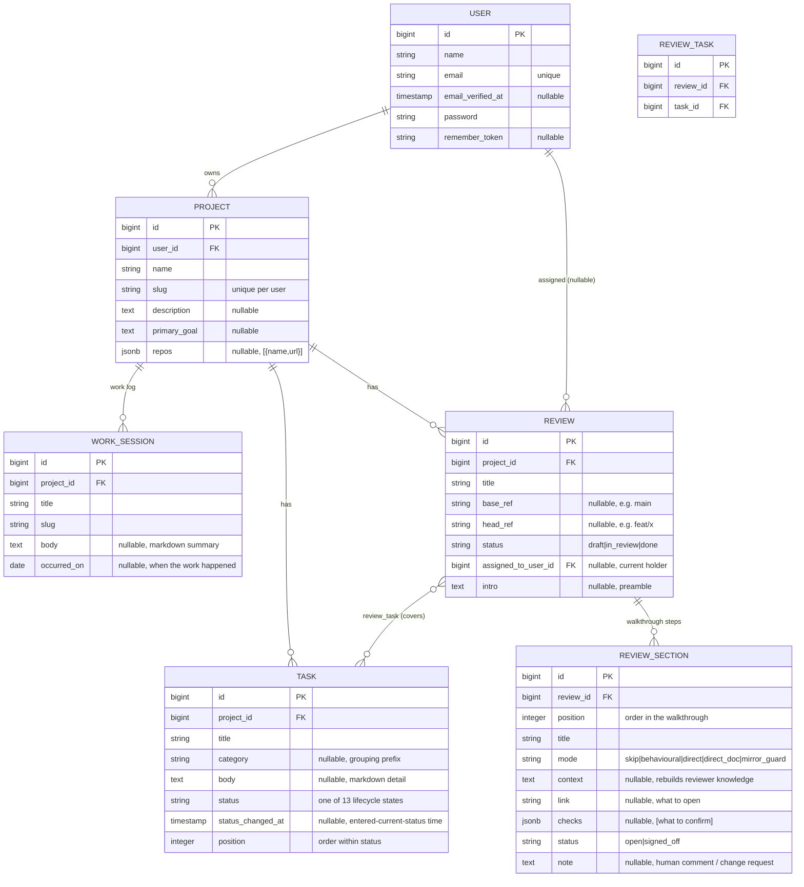

# Data model — Lodestar

> **How to read:** the **Tables** and **Invariants** below are the summary you
> read first; the **Diagram** at the end is the exact picture — every migrated
> app table with its fields and types. This file **mirrors the built schema**:
> every table that exists in `www/database/migrations/`. A test
> (`tests/Feature/SchemaMirrorTest.php`) parses the diagram and asserts it
> matches the live schema, so this doc cannot silently drift.

Lodestar is the home base for software work: **Projects** hold **Tasks** (kanban
cards that ride a 13-state lifecycle), **WorkSessions** (a work-log), and
**Reviews** (a change reviewed against a base, walked through as ordered
**ReviewSections**). Everything is **multi-tenant by ownership** — a Project
belongs to a User, and everything else reaches its owner through that Project.

## Tables (the nouns)

- **Project** — a group of repos with a shared goal, owned by a `user`. The home
  base its tasks, work-sessions and reviews all hang off. `name` + a per-user
  unique `slug`; an optional `description` and `primary_goal`; `repos` is a JSON
  list of `{ name, url }` (kept as JSON until a Repo model earns its own table).
- **Task** — a kanban card. `status` is one of the **13 lifecycle states** (see
  Invariants); `position` orders cards within a single status; `category` is a
  free-text grouping prefix (e.g. `mcp`, `infra`); `body` is the card detail.
  `status_changed_at` records when the card last entered its current status (the
  "Nh in status" timer) and is stamped automatically on every status change.
- **WorkSession** — a work-log entry (the running history a project kept).
  `title` + `slug`, a markdown `body`, and `occurred_on` (the date the work
  happened). Named `work_sessions` so it never collides with Laravel's framework
  `sessions` table. *(Model + table exist; no UI yet.)*
- **Review** — a change reviewed against a base (e.g. a branch vs main). Carries
  `base_ref`/`head_ref` (the intended comparison), a `status` (draft / in_review
  / done), an `intro` preamble, and `assigned_to_user_id` — the human currently
  holding the review. A human must **atomically self-assign** a review before
  they may sign off its sections (the human mirror of an agent claiming a task).
  A review covers many tasks and a task can appear in many reviews (the
  `review_task` pivot).
- **ReviewSection** — one ordered step of a review walkthrough — the data behind
  the HTML walkthrough screen. `position` orders the sections; `mode` is the
  review mode (`skip` / `behavioural` / `direct` / `direct_doc` / `mirror_guard`);
  `context` rebuilds the reviewer's knowledge; `link` is what to open (a doc /
  file / route); `checks` is a JSON list of "what to confirm"; `status`
  (`open` / `signed_off`) + `note` carry the human's per-section sign-off.

**Pivots**

- **review_task** — the many-to-many link between a Review and the Tasks it
  covers. Unique `(review_id, task_id)`; both sides cascade-delete, so the link
  disappears with either end.

(Laravel scaffolding — `users`, `sessions`, `cache`, `jobs`, etc. — is standard
and omitted here, except `users` which the diagram draws as the ownership root.)

## Invariants

These are the rules the column list alone won't tell you:

- **Multi-tenant by ownership.** A Project `belongsTo` a User; Tasks,
  WorkSessions and Reviews `belongsTo` a Project. There is no per-row `user_id`
  below Project — ownership is reached through `project.user_id`, and every
  controller method checks `project->user_id === request->user()->id` (403
  otherwise). `(user_id, slug)` is unique, so a slug is unique *per user*, not
  globally.
- **A Task's status is one of 13 — 12 live + `cancelled`.** The live pipeline,
  in order: `new → ready_for_planning → planning → plan_review → ready_for_dev →
  developing → ready_for_ai_review → ai_review → human_review → approved →
  merge_deploy → done`. `cancelled` is the archive (a soft-delete; there is no
  hard delete). The board groups the 12 live states into **5 phase columns**
  (Backlog · Plan · Build · Review · Ship) and colours each card by the **actor**
  it waits on (needs-human / queued / ai-working / done / archived).
- **Status moves are legal-only.** A Task may only move to a status in its
  allowed-transition set (`Task::TRANSITIONS`); an illegal jump is rejected (422
  / validation error). The transition map is forward · back · cancel per state,
  with `cancelled` restoring to `new`. The lists, phases, actors, labels and
  transition map all live as constants on `App\Models\Task`.
- **`status_changed_at` is stamped automatically.** A `saving` model hook stamps
  it whenever `status` is dirty (or on first save), so every code path — the
  board, tinker, a future agent loop — keeps the timer honest. A non-status edit
  never re-stamps it.
- **`position` orders within a single status, not across the board.** A new card
  lands at `max(position) + 1` within its status; intra-status drag rewrites
  `position` for exactly the cards in that status. Reordering never changes
  status — lifecycle moves go through the transition path so only legal moves
  are allowed.
- **A review is claimed by a single human at a time.** `assigned_to_user_id` is
  set by a **conditional UPDATE guarded on `WHERE assigned_to_user_id IS NULL`**
  (`Review::claimFor`), making claim a single atomic check-and-set — no
  read-then-write race, no double-assignment. Release is guarded the same way
  (`WHERE assigned_to_user_id = :holder`), so a non-holder can never clear
  another reviewer's claim. Section sign-off is gated on holding the review.
- **The walkthrough is the section list, top-to-bottom.** A Review's sections
  are ordered by `position`; the screen rebuilds context as the reviewer
  descends, and the progress bar / "ready" banner are driven by how many
  sections are `signed_off`.

## Diagram

Every migrated app table in full (fields + types). Types are the migration types
(`jsonb` = JSON cast to array). Laravel scaffolding tables other than `users`
are omitted. Three things are **deliberately** left out of the boxes and ignored
by the schema-match test: **timestamps** (`created_at` / `updated_at`, on every
table); **indexes / FK indexes**; and **`unsigned`** integer qualifiers (this
app runs on Postgres, which has no unsigned int type).

